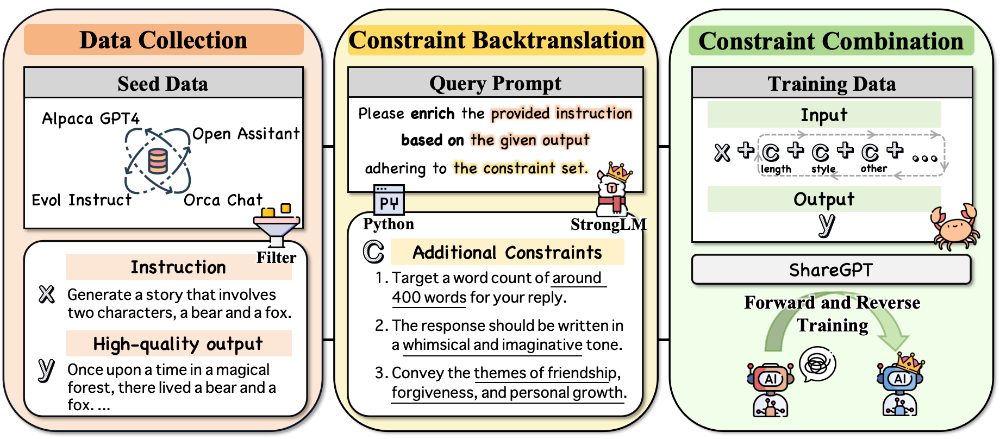
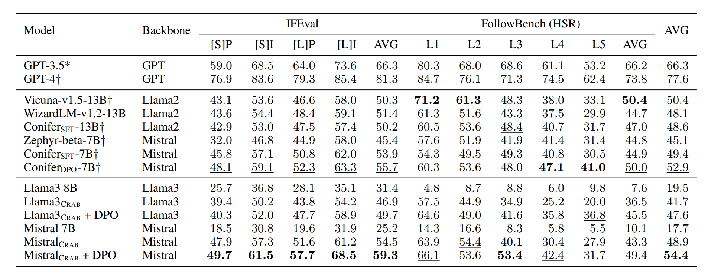

# Constraint Back-translation Improves Complex Instruction Following of Large Language Models
<p align="center">
    <a href="https://arxiv.org/abs/2405.05008"></a>
    <a href="https://huggingface.co/collections/THU-KEG/crab-672474f5ba8200630b57f884"></a>
    <a href="https://github.com/THU-KEG"></a>
</p>

<p align="justify">
Large language models (LLMs) struggle to follow instructions with complex constraints in format, length, etc. Following the conventional instruction-tuning practice, previous works conduct post-training on complex instruction-response pairs generated by feeding complex instructions to advanced LLMs. However, even advanced LLMs cannot follow complex instructions well, thus limiting the quality of generated data. In this work, we find that <b><i>existing datasets inherently contain implicit complex constraints</i></b> and propose a novel data generation technique, <b><i>constraint back-translation</i></b>. Specifically, we take the high-quality instruction-response pairs in existing datasets and only adopt advanced LLMs to add complex constraints already met by the responses to the instructions, which naturally reduces costs and data noise. In the experiments, we adopt Llama3-70B-Instruct to back-translate constraints and create a high-quality complex instruction-response dataset, named <b>CRAB</b>. We present that post-training on <font face="Verdana">CRAB</font> improves multiple backbone LLMs' complex instruction-following ability, evaluated on extensive instruction-following benchmarks. We further find that constraint back-translation also serves as a useful auxiliary training objective in post-training.

- 📖 Paper: [Constraint Back-translation Improves Complex Instruction Following of Large Language Models](https://arxiv.org/abs/2410.24175)
- 🦀 CRAB in the 🤗HuggingFace Hub: [Datasets and Models](https://huggingface.co/collections/THU-KEG/crab-672474f5ba8200630b57f884)
</p>


## Crab: SFT Dataset Construction
<p align="center">

</p>

🌟**You can directly download the CRAB dataset for SFT from [HF repo](https://huggingface.co/datasets/THU-KEG/Crab-SFT).**

We also provide a pipeline for constructing high-quality complex instruction-following datasets, enabling you to generate your own customized Crab dataset using the following steps.

**1. Prepare the seed data.**

To prepare your environment for data processing, download the following datasets from the provided links and place them into the specified directory structure.

- Open-Assistant Dataset  : [OpenAssistant on HF](https://huggingface.co/datasets/OpenAssistant/oasst2)
- WizardLM Dataset  : [WizardLM on HF](https://huggingface.co/datasets/WizardLMTeam/WizardLM_evol_instruct_V2_196k/tree/main)
- Alpaca_GPT4 Dataset  : [Alpaca GPT-4 on Github](https://github.com/Instruction-Tuning-with-GPT-4/GPT-4-LLM?tab=readme-ov-file#data-release)
- Orca-Chat Dataset  : [Orca-Chat on HF](https://huggingface.co/datasets/shahules786/orca-chat?row=0)
- ShareGPT Dataset  : [ShareGPT on HF](https://huggingface.co/datasets/anon8231489123/ShareGPT_Vicuna_unfiltered), Note: Follow the repository’s instructions to generate a 53k training dataset.

Once downloaded, ensure that each dataset is organized into the designated directory structure:

```plaintext
data/
└── raw_data/
    ├── oasst2/
    ├── WizardLM/
    ├── GPT-4-LLM-main/
    ├── orca-Chat/
    └── ShareGPT_Vicuna_unfiltered
```

**2. Data Generation**

Execute the scripts in the `scripts` directory sequentially to generate the final dataset:

- **`Crab_0_Data_Collection.sh`**: Collects high-quality seed data.
- **`Crab_1_Constraint_Back_Translation.sh`**: Generates constraints through back-translation.
- **`Crab_2_Constraint_Combination.sh`**: Combines constraints to produce the final training data.


## Training
For model training, we utilize different frameworks depending on the model architecture:

- **Mistral-7B based models**: Use the [alignment-handbook](https://github.com/huggingface/alignment-handbook) for training guidance.
- **LLaMA-3-8B based models**: Follow the [open-instruct](https://github.com/allenai/open-instruct) repository for specific instructions.

Refer to their respective GitHub repositories for further training instructions.
## Evaluation

The following evaluation benchmarks were used in our paper to measure model performance:

- [IFEval](https://github.com/google-research/google-research/tree/master/instruction_following_eval)
- [FollowBench](https://github.com/YJiangcm/FollowBench)

## Performance
<p align="center">

</p>


## Citation
```bibtex
@misc{qi2024constraintbacktranslationimprovescomplex,
      title={Constraint Back-translation Improves Complex Instruction Following of Large Language Models}, 
      author={Yunjia Qi and Hao Peng and Xiaozhi Wang and Bin Xu and Lei Hou and Juanzi Li},
      year={2024},
      eprint={2410.24175},
      archivePrefix={arXiv},
      primaryClass={cs.CL},
      url={https://arxiv.org/abs/2410.24175}, 
}
```